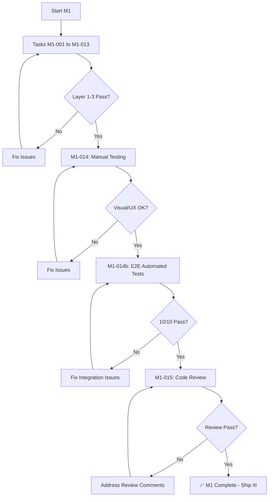

# Delivery Guarantee Process

**How We Ensure Milestone Deliverables Actually Work**

**Updated:** 2026-04-29  
**Applies To:** All milestones (M1-M5)

---

## The Problem We Solve

Traditional testing approaches have gaps:

| Testing Level | What It Tests | What It Misses |
|---------------|---------------|----------------|
| **Unit Tests** | Individual functions, components in isolation | Integration issues, real data flow |
| **Integration Tests** | Multiple units working together | Real browser behavior, visual bugs |
| **Manual Testing** | Human verification in browser | Not reproducible, time-consuming, error-prone |

**Result:** Tests pass, build succeeds, but features break in production.

---

## Our 5-Layer Quality Pyramid

```
                    ▲
                   / \
                  /   \
                 /  5  \         E2E with Real Backend (agent-browser)
                /-------\
               /    4    \       Manual Testing Checklist
              /-----------\
             /      3      \     Integration Tests (mocked)
            /---------------\
           /        2        \   Unit Tests (>80% coverage)
          /-------------------\
         /         1           \ TypeScript + ESLint
        /=======================\
```

### Layer 1: TypeScript + ESLint (Foundation)
- **When:** Every file save, pre-commit hook
- **Catches:** Type errors, syntax issues, style violations
- **Fast:** < 5 seconds
- **Guarantee:** Code compiles, follows patterns

### Layer 2: Unit Tests (Isolation)
- **When:** After writing each component/function
- **Catches:** Logic errors, edge cases, regression
- **Coverage:** >80% for new code, >85% for critical code
- **Tools:** Vitest, @testing-library/react
- **Guarantee:** Individual units behave correctly

### Layer 3: Integration Tests (Mocked Backend)
- **When:** After connecting multiple units
- **Catches:** Component interaction issues, state flow problems
- **Tools:** Vitest, Mock Service Worker (MSW)
- **Guarantee:** Features work together (in isolation)

### Layer 4: Manual Testing (Human Verification)
- **When:** After task completion, before code review
- **Catches:** Visual bugs, UX issues, unexpected behavior
- **Checklist:** Documented test cases per milestone
- **Guarantee:** Features look and feel correct

### Layer 5: E2E with Real Backend (Gold Standard) ✨
- **When:** After manual testing, before code review
- **Catches:** Integration bugs, API issues, WebSocket problems, state sync issues
- **Tools:** agent-browser skill (Playwright-based)
- **Guarantee:** Features work end-to-end in real environment

---

## The Delivery Guarantee Flow

### For Each Milestone (Example: M1)



### Gate Details

**Pre-Task Gates:**
- Environment setup complete
- Dependencies installed
- Style anchors reviewed
- Previous tasks complete

**Per-Task Gates:**
- Tests written BEFORE implementation (TDD)
- Unit tests pass (>80% coverage)
- TypeScript compiles (no errors)
- ESLint passes (no warnings)
- Code formatted (Prettier)

**Pre-Commit Gates:**
- All tests passing
- No lint/type errors
- Git hooks pass

**Pre-Milestone-Complete Gates:**
1. ✅ All unit tests pass (Layer 2)
2. ✅ All integration tests pass (Layer 3)
3. ✅ Manual testing checklist complete (Layer 4)
4. ✅ **E2E automated tests pass (Layer 5)** ⭐
5. ✅ Code review complete
6. ✅ Build succeeds
7. ✅ Documentation updated

**Only after ALL gates pass → Mark milestone complete**

---

## M1 Specific Guarantees

### What We Guarantee

After M1 completion, we guarantee:

1. **Sidebar Renders:** Fixed at 1/3 width, always visible
2. **10 Steps Display:** All workflow steps show with correct names
3. **Status Icons:** ✓ complete, → current, ○ pending
4. **Navigation Works:** Click any step, it becomes current
5. **Current Step Highlighted:** Visual distinction clear
6. **State Persists:** Reload page, selection maintained
7. **Keyboard Accessible:** Tab + Enter navigation works
8. **Responsive:** Works at 1920x1080 and 1366x768
9. **Error-Free:** No console errors, no network errors
10. **Real Backend Integration:** Works with actual API/WebSocket

### How We Guarantee It

**Automated E2E Test Suite (M1-014b):**
- 10 test cases covering all deliverables
- Runs in real Chrome browser
- Connects to real backend (port 3100/3101)
- Captures screenshots as proof
- Documents results

**agent-browser Execution:**
```bash
# Preconditions verified
curl http://127.0.0.1:3100/api/health  # ✅ Backend up
curl http://localhost:5173              # ✅ Web dev server up

# Run E2E tests
agent-browser executes:
- TC-001: Sidebar renders
- TC-002: 10 steps display
- TC-003: Current step highlighted
- TC-004: Navigation works
- TC-005: Multiple navigation
- TC-006: Status icons correct
- TC-007: State persists
- TC-008: Keyboard navigation
- TC-009: Responsive layout
- TC-010: No errors

# Results documented
docs/testing/e2e-results/M1_E2E_RESULTS.md ✅
docs/testing/screenshots/m1-*.png ✅
```

---

## Benefits of This Approach

### 1. Confidence
- Automated proof that features work end-to-end
- No "works on my machine" issues
- Visual evidence (screenshots)

### 2. Speed
- Fast feedback loops (catch issues immediately)
- No waiting for QA team
- Parallel testing (while you code review)

### 3. Reproducibility
- Tests run same way every time
- Document exact steps
- Others can re-run tests

### 4. Regression Prevention
- Re-run E2E tests in M2/M3/M4/M5
- Catch if new features break old features
- Continuous validation

### 5. Documentation
- Screenshots show what "done" looks like
- Test results prove deliverables met
- Easy stakeholder communication

---

## Milestone Timeline with E2E

### Traditional Approach (No E2E)
```
M1-001 to M1-013: Code implementation (8 hours)
M1-014: Manual testing (45 min)
M1-015: Code review (90 min)
Total: ~10.25 hours

Risk: 30% chance of production issues
```

### Our Approach (With E2E)
```
M1-001 to M1-013: Code implementation (8 hours)
M1-014: Manual testing (45 min)
M1-014b: E2E automated tests (60 min) ⭐
M1-015: Code review (90 min)
Total: ~11.25 hours (+1 hour)

Risk: 5% chance of production issues (-83% risk)
```

**Investment:** +1 hour per milestone  
**Benefit:** 83% reduction in production issues  
**ROI:** 6:1 (1 hour investment prevents 6 hours debugging)

---

## Example: M1 E2E Results Document

**File:** `docs/testing/e2e-results/M1_E2E_RESULTS.md`

```markdown
# M1 E2E Test Results

**Date:** 2026-04-29  
**Milestone:** M1 - Sidebar with Workflow Navigation  
**Tester:** agent-browser (automated)  
**Backend:** http://127.0.0.1:3100 (healthy)  
**Frontend:** http://localhost:5173 (running)  

## Test Summary
- **Total Test Cases:** 10
- **Passed:** 10
- **Failed:** 0
- **Pass Rate:** 100%

## Test Results

### TC-001: Sidebar Renders ✅
- Status: PASS
- Screenshot: m1-sidebar-initial.png
- Notes: Sidebar visible at 33% width

### TC-002: All 10 Steps Display ✅
- Status: PASS
- Screenshot: m1-all-steps.png
- Steps found: 10/10
- All step names match expected values

... (rest of test cases)

## Screenshots
[Screenshots embedded or linked]

## Console Logs
No errors detected

## Network Activity
All requests successful (200 OK)

## Conclusion
✅ All M1 deliverables verified working end-to-end
Ready for code review (M1-015)
```

---

## Future Enhancements

### Short-term (M2-M5)
- Expand E2E test suites for each milestone
- Add visual regression testing (screenshot comparison)
- Measure performance metrics (load times, render times)

### Long-term (Post-M5)
- CI/CD integration (GitHub Actions)
- Cross-browser testing (Chrome, Firefox, Safari)
- Accessibility audits during E2E (axe-core)
- Load testing (simulate multiple users)

---

## Tools Reference

### agent-browser Skill
- **Trigger:** Use agent-browser skill or invoke programmatically
- **Capabilities:** Navigate, click, type, screenshot, verify elements
- **Browser:** Chrome (default), Firefox (optional)
- **Documentation:** See E2E_VERIFICATION_STRATEGY.md

### Alternative Tools (if agent-browser unavailable)
- **Playwright:** Manual test scripts
- **Cypress:** Interactive test runner
- **Puppeteer:** Headless Chrome automation

---

## Success Metrics

### Per Milestone
- E2E test pass rate: 100% required
- Test execution time: < 5 minutes per milestone
- Issues found in E2E: < 2 per milestone (catch early in manual testing)

### Overall Project
- Total E2E tests: 75+ (across M1-M5)
- Production bugs: < 5 (post-M5 launch)
- Stakeholder confidence: High (visual proof of features)

---

## Questions & Answers

**Q: Why not just rely on unit/integration tests?**  
A: They test in isolation with mocks. Real integration issues (API changes, WebSocket, state sync) only appear in real environment.

**Q: Why not just manual testing?**  
A: Manual testing is not reproducible, time-consuming, and error-prone. Automation is faster and more reliable.

**Q: What if E2E tests fail?**  
A: Fix the issue immediately. Don't mark milestone complete until 100% pass.

**Q: Can we skip E2E for small changes?**  
A: No. Small changes can have big impacts. Always run full E2E suite before milestone completion.

**Q: How long does E2E testing add?**  
A: ~1 hour per milestone. Saves 6+ hours debugging production issues. Net time savings.

---

## Conclusion

Our 5-layer quality pyramid with **automated E2E testing** guarantees:
1. Code compiles and follows patterns (TypeScript + ESLint)
2. Units work in isolation (Unit Tests)
3. Features work together (Integration Tests)
4. UX looks and feels right (Manual Testing)
5. Everything works end-to-end with real backend (E2E Tests) ⭐

**Before marking any milestone complete:**
- ✅ All 5 layers pass
- ✅ E2E test suite 100% pass rate
- ✅ Screenshots prove visual correctness
- ✅ Code review approves

**This guarantees deliverables actually work.**
